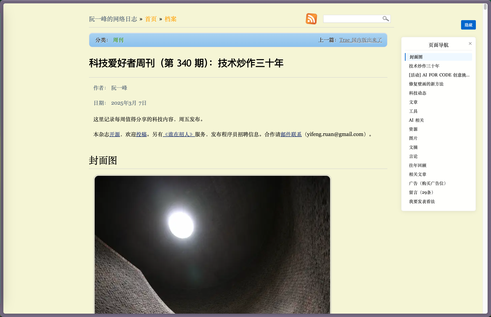

# 阮一峰网站导航 - 油猴脚本

## 简介

这是一个为阮一峰的网站（https://www.ruanyifeng.com/blog/）添加页面导航功能的油猴脚本。通过这个脚本，您可以在阅读阮一峰博客文章时，快速浏览和跳转到文章中的各个章节，提高阅读效率。

## 效果展示

当您访问阮一峰的博客文章时，页面右侧会出现如下导航栏：

## 功能特点

- 自动识别页面中的所有 h2 标题，生成页面导航目录
- 导航固定在页面右侧，不遮挡正文内容
- 点击导航项可平滑滚动到对应章节
- 当前阅读位置的导航项会自动高亮显示
- 提供显示/隐藏按钮，可随时切换导航的显示状态
- 美观的UI设计，包含悬停效果和平滑动画

## 安装方法

1. 首先，您需要在浏览器中安装 Tampermonkey 扩展：
   - [Chrome 版 Tampermonkey](https://chrome.google.com/webstore/detail/tampermonkey/dhdgffkkebhmkfjojejmpbldmpobfkfo)
   - [Firefox 版 Tampermonkey](https://addons.mozilla.org/en-US/firefox/addon/tampermonkey/)
   - [Edge 版 Tampermonkey](https://microsoftedge.microsoft.com/addons/detail/tampermonkey/iikmkjmpaadaobahmlepeloendndfphd)

2. 安装完成后，点击浏览器工具栏中的 Tampermonkey 图标，选择「创建新脚本」

3. 将本项目中的 `index.js` 文件内容复制粘贴到编辑器中

4. 点击「文件」→「保存」，或按 Ctrl+S (Mac 上为 Command+S) 保存脚本

## 使用说明

1. 安装脚本后，访问任意阮一峰的博客文章页面（https://www.ruanyifeng.com/blog/）

2. 脚本会自动在页面右侧生成导航栏，显示文章中的所有 h2 标题

3. 功能按钮说明：
   - 页面右上角的「隐藏/导航」按钮：点击可切换导航栏的显示状态
   - 导航栏右上角的「×」按钮：点击可关闭导航栏

4. 导航使用：
   - 点击任意导航项可快速跳转到对应章节
   - 滚动页面时，当前位置对应的导航项会自动高亮
   - 鼠标悬停在导航项上会显示悬停效果

## 兼容性

本脚本适用于所有安装了 Tampermonkey 的现代浏览器，包括但不限于：
- Google Chrome
- Mozilla Firefox
- Microsoft Edge
- Safari (需先安装 Tampermonkey)

## 开发背景

阮一峰的博客包含大量优质技术文章，但长文章阅读时缺少导航功能。本脚本旨在提升阅读体验，让读者能够快速定位和跳转到感兴趣的章节。

## 许可证

本项目采用 MIT 许可证。

## 贡献

欢迎提交 Issue 或 Pull Request 来改进这个脚本！